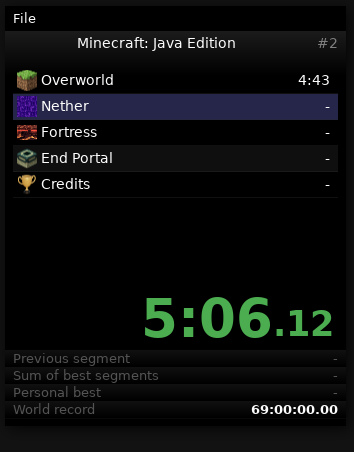

<!-- markdownlint-disable MD033 MD041 -->
<p align="center">
    
</p>
<h1 align="center">Urn split tracker</h1>

<p align="center">
    
    
    
    
</p>

## About

> This simple split tracker was hacked together by [3snow p7im](https://github.com/3snowp7im).
> It was originally written because there were no existing
> solutions for split tracking with a delayed start available
> on *nix platforms.

**Forked** from the [original project](https://github.com/3snowp7im/urn).

### Features added

- Icons support for splits
- Feedback error when opening invalid JSON files
- Now the last split folder is saved ([pull request by @Thue](https://github.com/3snowp7im/urn/pull/49))
- New default theme (LiveSplit theme)
- New shortcut to keep window always on top (Ctrl+K)
- More friendly README.md
- Nicer time format
- New Urn icon ✨

### Bugs fixed

- Timer kept running in the background while paused
- User was able to skip the last split

<p align="center">
    
    
</p>

---

## Quick start and installation

For Arch-based distros, see the [`urn-git` package](<https://aur.archlinux.org/packages/urn-git>) thanks to @belsmith.

For NixOS, see the [`urn-timer` package](<https://search.nixos.org/packages?query=urn-timer>) thanks to [@fgaz](https://github.com/fgaz).

### Building

Urn requires `gtk3`, `x11` and `jansson`; installation requires `imagemagick` and `xxd`.
The default font is `DejaVu`.

On Debian-based systems:

```sh
sudo apt update
sudo apt install build-essential libgtk-3-dev libjansson-dev imagemagick xxd fonts-dejavu
```

Clone the project:

```sh
git clone https://github.com/paoloose/urn
cd urn
```

Now compile and install **Urn** (see details in the [Makefile](https://github.com/paoloose/urn/blob/master/Makefile))

```sh
make && sudo make install
```

All ready! Now start the desktop **Urn** application or run `/usr/local/bin/urn-gtk`.

---

## ✨ Usage

When you start the **Urn** application, a file dialog will appear to select
a Split JSON file (see [Split files](#split-files)).

Initially, the window is undecorated. You can toggle window decorations
by pressing the `Right Control` key.

The timer is controlled with the following keys
(note that **they depend on the timer state**):

| Key                  | Stopped     | Started    |
| -------------------- | ----------- | ---------- |
| <kbd>Spacebar</kbd>  | Start timer | Split      |
| <kbd>Backspace</kbd> | Reset timer | Stop timer |
| <kbd>Delete</kbd>    | Cancel      | -          |

Cancel will **reset the timer** and **decrement the attempt counter**. A run that is reset before the [start delay](#main-object) is automatically
canceled.

If you forgot to split, or accidentally split twice,
you can manually change the current split:

| Key                  | Action     |
| -------------------- | ---------- |
| <kbd>Page Up</kbd>   | Unsplit    |
| <kbd>Page Down</kbd> | Skip split |

Keybinds can be configured by changing your `gsettings`. See
[Modifying the default values](#modifying-the-default-values).

## Settings and keybinds

The setting schema is defined in the
[urn-gtk.gschema.xml](https://github.com/paoloose/urn/blob/master/urn-gtk.gschema.xml) file.

| Setting           | Type    | Description                        | Default        |
| ----------------- | ------- | ---------------------------------- | -------------- |
| `start-decorated` | Boolean | Start with window decorations      | `false`        |
| `start-on-top`    | Boolean | Start with window as always on top | `true`         |
| `hide-cursor`     | Boolean | Hide cursor in window              | `false`        |
| `global-hotkeys`  | Boolean | Enables global hotkeys             | `false`        |
| `theme`           | String  | Default theme name                 | `'live-split'` |
| `theme-variant`   | String  | Default theme variant              | `''`           |

| Keybind                      | Type   | Description                       | Default               |
| ---------------------------- | ------ | --------------------------------- | --------------------- |
| `keybind-start-split`        | String | Start/split keybind               | <kbd>Space</kbd>      |
| `keybind-stop-reset`         | String | Stop/Reset keybind                | <kbd>Backspace</kbd>  |
| `keybind-cancel`             | String | Cancel keybind                    | <kbd>Delete</kbd>     |
| `keybind-unsplit`            | String | Unsplit keybind                   | <kbd>Page Up</kbd>    |
| `keybind-skip-split`         | String | Skip split keybind                | <kbd>Page Down</kbd>  |
| `keybind-toggle-decorations` | String | Toggle window decorations keybind | <kbd>Right Ctrl</kbd> |

The next section shows how to change these values.

### Modifying the default values

You can change the values in the `wildmouse.urn` path with `gsettings`:

```bash
# Enabling the global hotkeys
gsettings set wildmouse.urn global-hotkeys true

# Changing the Urn theme
gsettings set wildmouse.urn theme <my-theme>

# Change the keybind to start/split
gsettings set wildmouse.urn keybind-start-split "<Alt>space"
```

Of course, you can directly edit the [urn-gtk.gschema.xml](https://github.com/paoloose/urn/blob/master/urn-gtk.gschema.xml)
default values, but note that you will need to `sudo make install` again to get
the required file `urn-gtk.gschema.xml` into the expected location.

Keybind strings must be parsable by the
[gtk_accelerator_parse](https://docs.gtk.org/gtk4/func.accelerator_parse.html).
See the [complete list of keynames](https://github.com/GNOME/gtk/blob/main/gdk/keynames.txt) for `gdk`. Modifiers are enclosed in angular brackets <>: `<Shift>`, `<Ctrl>`, `<Alt>`, `<Meta>`, `<Super>`, `<Hyper>`. Note that you should use `<Alt>a` instead of `<Alt>-a` or similar.

## Colors

The color of a time or delta has a special meaning.

| Color       | Meaning                                |
|-------------|----------------------------------------|
| Dark red    | Behind splits in PB and losing time    |
| Light red   | Behind splits in PB and gaining time   |
| Dark green  | Ahead of splits in PB and gaining time |
| Gold        | Best segment time in any run           |

## Split Files

Split files are stored as well-formed JSON and **must** contain
one [main object](#main-object).

You can use splits located in
[`splits-examples/`](https://github.com/paoloose/urn/tree/main/splits_examples)
to start creating your own split files and place them wherever you want.

### Main object

| Key             | Value                                   |
| --------------- | --------------------------------------- |
| `title`         | Title string at top of window           |
| `attempt_count` | Number of attempts                      |
| `start_delay`   | Non-negative delay until timer starts   |
| `world_record`  | Best known time                         |
| `splits`        | Array of [split objects](#split-object) |
| `theme`         | Window theme                            |
| `theme_variant` | Window theme variant                    |
| `width`         | Window width                            |
| `height`        | Window height                           |

Most of the above keys are optional.

### Split object

| Key            | Value                  |
| -------------- | ---------------------- |
| `title`        | Split title            |
| `icon`         | Icon file path or url  |
| `time`         | Split time             |
| `best_time`    | Your best split time   |
| `best_segment` | Your best segment time |

Times are strings in `HH:MM:SS.mmmmmm` format. Icons can be either a local
file path (preferably absolute) or a URL. Note that only GTK-supported
image formats will work. For example, `.svg` and `.webp` doesn't.

## Themes

Create a theme stylesheet and place it in `themes/<name>/<name>.css` or
directly in `~/.urn/themes/<name>/<name>.css`, where `name` is the name of your theme.

You can set the global theme by changing the `theme` value in gsettings.

Theme variants should follow the pattern `<name>-<variant>.css`.
Each split file can apply their own themes by specifying a `theme` key in the main object.

See [this repo](https://github.com/TheBlackParrot/urn-themes) for a list of
ready-to-use themes.

See [this](https://docs.gtk.org/gtk3/css-properties.html) for a list of supported
CSS properties. Note that you can also modify the default font-family.

| Urn CSS classes        |
| ---------------------- |
| `.window`              |
| `.header`              |
| `.title`               |
| `.attempt-count`       |
| `.time`                |
| `.delta`               |
| `.timer`               |
| `.timer-seconds`       |
| `.timer-millis`        |
| `.delay`               |
| `.splits`              |
| `.split`               |
| `.current-split`       |
| `.split-title`         |
| `.split-icon`          |
| `.split-time`          |
| `.split-delta`         |
| `.split-last`          |
| `.done`                |
| `.behind`              |
| `.losing`              |
| `.best-segment`        |
| `.best-split`          |
| `.footer`              |
| `.prev-segment-label`  |
| `.prev-segment`        |
| `.sum-of-bests-label`  |
| `.sum-of-bests`        |
| `.personal-best-label` |
| `.personal-best`       |
| `.world-record-label`  |
| `.world-record`        |

If a split has a `title` key, its UI element receives a class
name derived from its title. Specifically, the title is lowercase
and all non-alphanumeric characters are replaced with hyphens, and
the result is concatenated with `split-title-`. For instance,
if your split is titled "First split", it can be styled by
targeting the CSS class `.split-title-first-split`.

---

## FAQ

- How to resize the window application?

    Edit the `width` and `height` properties in the [split JSON file](#main-object).

- How to change the default keybinds?

    You can edit the keybinds defined in `urn-gtk.gschema.xml` file or change
    your urn settings with `gsettings`. See [Settings and keybinds](#modifying-the-default-values).

- How to make the keybinds global

    Set the `global-hotkeys` property as true. See [Settings and Keybinds](#settings-and-keybinds).
    For Wayland users, see [#9](https://github.com/paoloose/urn/issues/9).

    TL;DR: Wayland users reported that enabling `global-hotkeys` causes the application to crash.
    As a result, this setting is ignored on Wayland by default. You can override this behavior by
    defining the `URN_FORCE_GLOBAL_HOTKEYS` environment variable:

    ```bash
    # In urn.desktop
    URN_FORCE_GLOBAL_HOTKEYS=1 urn-gtk
    ```

    We are looking for a better approach to get global hotkeys in Wayland. See [#19](https://github.com/paoloose/urn/issues/19).

- Can I modify the Urn appearance?

    Yes. You can modify the default CSS theme (`themes/live-split`), download
    [online themes](https://github.com/TheBlackParrot/urn-themes),
    or [make your own theme](#themes).

- How to make my own split file?

    You can use `splits/sotn.json` as an example. You can place the
    split files wherever you want, just open them when starting urn.

- How can I define custom icons for my splits?

    Yes! You can use local files or web urls. See the `icon` key in the [split object](#split-object).

    The default icon size is 20x20px, but you can change it like so:

    ```css
    .split-icon {
        min-width: 24px;
        min-height: 24px;
        background-size: 24px;
    }
    ```

- Can I contribute?

    Yes, you can contribute by making [pull requests](https://github.com/paoloose/urn/pulls),
    or creating new themes or [reporting issues](https://github.com/paoloose/urn/issues).

---

## Uninstall Urn

Uninstall the desktop application by running

```sh
sudo make uninstall
```
